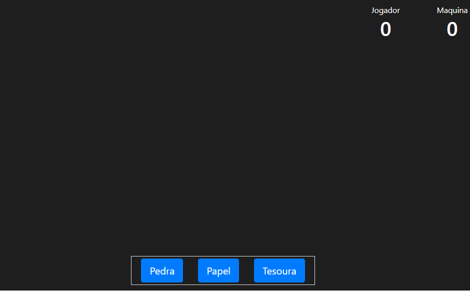
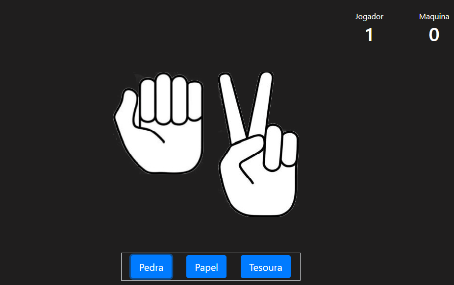
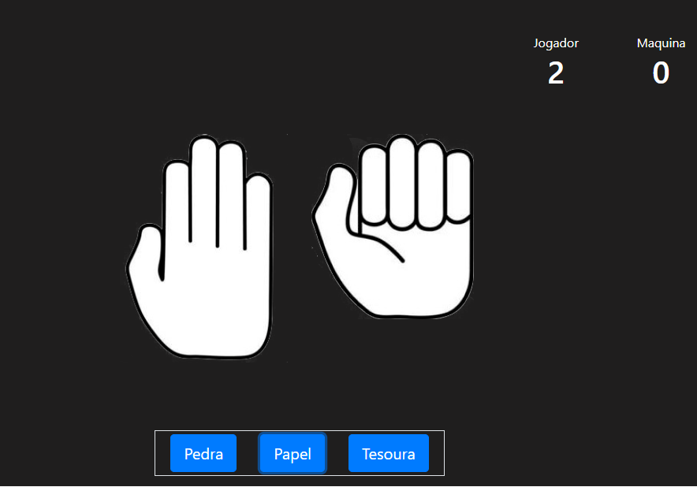
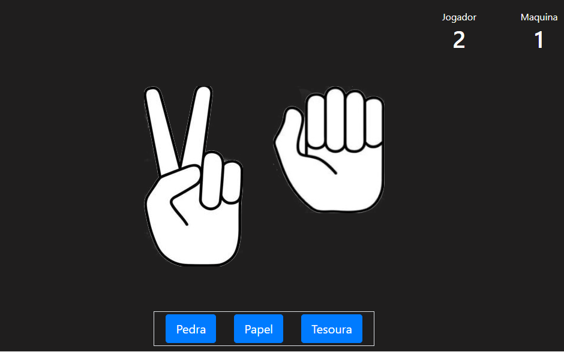

# Projeto Jokenpô
 ### Pedra, Papel, Tesoura
 
 #### Link do jogo
 
<a href="http://jokenpo.s3-website-sa-east-1.amazonaws.com/">Link do Jogo</a>
 
 
 ### Projeto
 Usando Angular criei um jogo de jokenpô, jogamos contra o computador tendo um placar contando os pontos dos jogadores
 
 
 #### Tecnologias usadas:
   - TypeScript
   - CSS
   - HTML
 
 

<h1 align="center">Inicio do Jogo</h1>

<h1 align="center">Pedra</h1>

<h1 align="center">Papel</h1>

<h1 align="center">Tesoura</h1>

